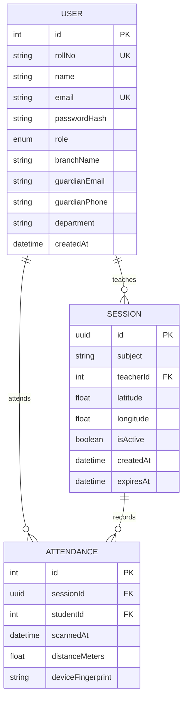

<p align="center">
  <h1 align="center">📚 Classroom Attendance System</h1>
  <p align="center">
    A modern, GPS-verified, QR-based attendance management platform for educational institutions.
    <br />
    <a href="#features"><strong>Explore Features »</strong></a>
    ·
    <a href="#getting-started"><strong>Get Started »</strong></a>
    ·
    <a href="#api-reference"><strong>API Reference »</strong></a>
  </p>
</p>

<br />

## Table of Contents

- [About the Project](#about-the-project)
- [Features](#features)
- [Tech Stack](#tech-stack)
- [Architecture](#architecture)
- [Getting Started](#getting-started)
  - [Prerequisites](#prerequisites)
  - [Installation](#installation)
  - [Environment Variables](#environment-variables)
  - [Database Setup](#database-setup)
  - [Running Locally](#running-locally)
- [Project Structure](#project-structure)
- [API Reference](#api-reference)
- [Database Schema](#database-schema)
- [Deployment](#deployment)
- [Contributing](#contributing)
- [License](#license)

---

## About the Project

**Classroom Attendance System** is a full-stack web application that digitizes and automates classroom attendance tracking. Teachers create geo-fenced attendance sessions and generate QR codes; students scan the QR code with their device camera and their location is verified against the teacher's position in real time. The system supports role-based dashboards, detailed analytics, manual attendance overrides, bulk user uploads, and email notifications — all wrapped in a responsive, modern UI.

---

## Features

### 🧑‍🏫 Teacher Dashboard

- **Session Management** — Start, monitor, and end attendance sessions with a single click.
- **QR Code Generation** — Automatically generates a unique QR code per session for students to scan.
- **GPS Geo-Fencing** — Teacher's location is captured at session start; student proximity is verified on scan.
- **Live Attendee Tracking** — Real-time attendee list with auto-refresh polling.
- **Manual Override** — Toggle any student's attendance status (Present / Absent) for current or past sessions.
- **Subject Analytics** — View per-subject session history with sortable attendance tables.
- **Student Reports** — Drill into individual student attendance records across all subjects.
- **Bulk CSV Upload** — Upload students or teachers in bulk via CSV files.
- **Email Notifications** — Send custom emails to students (with guardian CC) via Resend.

### 🎓 Student Dashboard

- **QR Scanner** — Scan attendance QR codes using the device camera (rear or front) or by uploading an image.
- **GPS Verification** — Location is automatically captured and compared against the teacher's session coordinates.
- **Device Fingerprinting** — Adds an additional layer of verification to prevent proxy attendance.
- **Attendance History** — View personal attendance records grouped by subject with percentage breakdowns.

### 🔐 Authentication & Security

- **Role-Based Access Control (RBAC)** — Separate flows and dashboards for `TEACHER` and `STUDENT` roles.
- **JWT Authentication** — Stateless, secure token-based authentication.
- **Password Hashing** — Passwords are hashed using `bcryptjs`.
- **Protected Routes** — Frontend route guards ensure role-appropriate access.

---

## Tech Stack

| Layer         | Technology                                                     |
| ------------- | -------------------------------------------------------------- |
| **Frontend**  | React 19, Vite 7, Tailwind CSS 4, React Router 7, Lucide Icons |
| **Backend**   | Node.js, Express 4, Prisma ORM 5                               |
| **Database**  | PostgreSQL (Neon Serverless)                                   |
| **Auth**      | JSON Web Tokens (JWT), bcryptjs                                |
| **QR Code**   | `qrcode.react` (generation), `html5-qrcode` (scanning)         |
| **Email**     | Resend API                                                     |
| **HTTP**      | Axios                                                          |
| **Dev Tools** | Nodemon, ESLint, PostCSS, Autoprefixer                         |

---

## Architecture

```
┌──────────────────────────────────────────────────────────────┐
│                        Client (Browser)                      │
│  React 19 + Vite · Tailwind CSS · React Router · Axios       │
│  ┌──────────┐  ┌────────────┐  ┌──────────────────────────┐  │
│  │  Login   │  │  Teacher   │  │      Student             │  │
│  │  Page    │  │  Dashboard │  │      Dashboard           │  │
│  │          │  │  (Sessions,│  │  (QR Scanner, History)    │  │
│  │          │  │  Reports)  │  │                          │  │
│  └──────────┘  └────────────┘  └──────────────────────────┘  │
└──────────────────────┬───────────────────────────────────────┘
                       │  REST API (JSON)
┌──────────────────────▼───────────────────────────────────────┐
│                    Server (Express.js)                        │
│  ┌──────────┐  ┌──────────┐  ┌────────────┐  ┌───────────┐  │
│  │  Auth    │  │ Session  │  │ Attendance │  │   Email   │  │
│  │  Routes  │  │ Routes   │  │  Routes    │  │   Routes  │  │
│  └────┬─────┘  └────┬─────┘  └─────┬──────┘  └─────┬─────┘  │
│       └──────────────┴──────────────┴───────────────┘        │
│                    Prisma ORM                                │
└──────────────────────┬───────────────────────────────────────┘
                       │  SQL
┌──────────────────────▼───────────────────────────────────────┐
│              PostgreSQL (Neon Serverless)                     │
│  ┌──────────┐  ┌──────────┐  ┌──────────────┐               │
│  │  User    │  │ Session  │  │  Attendance  │               │
│  └──────────┘  └──────────┘  └──────────────┘               │
└──────────────────────────────────────────────────────────────┘
```

---

## Getting Started

### Prerequisites

- **Node.js** ≥ 18
- **npm** ≥ 9
- **PostgreSQL** database (or a [Neon](https://neon.tech) serverless instance)

### Installation

```bash
# Clone the repository
git clone https://github.com/<your-username>/classroom-attendance.git
cd classroom-attendance

# Install all dependencies (backend + frontend)
npm run install-all
```

### Environment Variables

Create a `.env` file inside the `backend/` directory:

```env
# --- Server ---
PORT=5000
NODE_ENV=development

# --- Client ---
CLIENT_URL=http://localhost:5173

# --- Database (PostgreSQL) ---
DATABASE_URL="postgresql://<user>:<password>@<host>/<database>?sslmode=require"

# --- Authentication ---
JWT_SECRET=your_jwt_secret_key
JWT_EXPIRES_IN=1d

# --- Email (Resend) ---
RESEND_API_KEY=re_your_resend_api_key
```

Create a `.env` file inside the `frontend/` directory:

```env
VITE_API_URL=http://localhost:5000/api
```

### Database Setup

```bash
# Generate the Prisma client
npx prisma generate --schema=backend/prisma/schema.prisma

# Run database migrations
npx prisma migrate deploy --schema=backend/prisma/schema.prisma
```

### Running Locally

```bash
# Start both frontend and backend in development mode
npm run dev
```

| Service  | URL                     |
| -------- | ----------------------- |
| Frontend | `http://localhost:5173` |
| Backend  | `http://localhost:5000` |

---

## Project Structure

```
classroom/
├── backend/
│   ├── controllers/          # Request handlers
│   │   ├── attendance.controller.js
│   │   ├── auth.controller.js
│   │   ├── email.controller.js
│   │   └── session.controller.js
│   ├── middleware/            # Auth & error-handling middleware
│   ├── prisma/
│   │   ├── schema.prisma     # Database schema definition
│   │   └── migrations/       # Migration history
│   ├── routes/               # Express route definitions
│   ├── services/             # Business logic layer
│   │   ├── attendance.service.js
│   │   ├── auth.service.js
│   │   ├── email.service.js
│   │   └── session.service.js
│   ├── utils/                # Utility functions
│   ├── validators/           # Input validation
│   └── server.js             # App entry point
│
├── frontend/
│   ├── public/               # Static assets
│   └── src/
│       ├── components/
│       │   ├── auth/         # Login & registration forms
│       │   ├── dashboard/    # Teacher & student dashboard components
│       │   └── layout/       # Shared layout components
│       ├── context/          # React Context (AuthContext)
│       ├── hooks/            # Custom hooks (useTeacherDashboard, useStudentDashboard)
│       ├── pages/            # Route-level page components
│       ├── services/         # API service modules
│       └── utils/            # Client-side utilities (device fingerprint, etc.)
│
├── package.json              # Root scripts (install-all, build, dev, start)
└── README.md
```

---

## API Reference

### Authentication

| Method | Endpoint                | Description               | Auth |
| ------ | ----------------------- | ------------------------- | ---- |
| POST   | `/api/auth/register`    | Register a new user       | ✗    |
| POST   | `/api/auth/login`       | Login and receive JWT     | ✗    |
| POST   | `/api/auth/bulk-upload` | Bulk upload users via CSV | ✓    |

### Sessions

| Method | Endpoint                     | Description                        | Auth |
| ------ | ---------------------------- | ---------------------------------- | ---- |
| POST   | `/api/session/start`         | Start a new attendance session     | ✓    |
| POST   | `/api/session/:id/end`       | End an active session              | ✓    |
| GET    | `/api/session/active`        | Get the teacher's active session   | ✓    |
| GET    | `/api/session/:id/attendees` | Get attendees for a session        | ✓    |
| GET    | `/api/session/history`       | Get session history & analytics    | ✓    |
| POST   | `/api/session/:id/override`  | Override student attendance status | ✓    |

### Attendance

| Method | Endpoint                  | Description                      | Auth |
| ------ | ------------------------- | -------------------------------- | ---- |
| POST   | `/api/attendance/mark`    | Mark attendance (student-side)   | ✓    |
| GET    | `/api/attendance/history` | Get student's attendance history | ✓    |

### Email

| Method | Endpoint          | Description             | Auth |
| ------ | ----------------- | ----------------------- | ---- |
| POST   | `/api/email/send` | Send email to a student | ✓    |

### Health Check

| Method | Endpoint      | Description               |
| ------ | ------------- | ------------------------- |
| GET    | `/api/health` | Returns API health status |

---

## Database Schema



---

## Deployment

The project includes a production build script that compiles the frontend and serves it statically from the Express backend:

```bash
# Build for production
npm run build

# Start the production server
npm start
```

The `server.js` file serves the compiled frontend from `frontend/dist/` and handles all API routes, making it suitable for single-process deployment on platforms like **Render**, **Railway**, or **Fly.io**.

---

## Contributing

Contributions are welcome! Please follow these steps:

1. **Fork** the repository.
2. **Create** a feature branch: `git checkout -b feature/your-feature-name`
3. **Commit** your changes: `git commit -m "feat: add your feature"`
4. **Push** to the branch: `git push origin feature/your-feature-name`
5. **Open** a Pull Request.

Please ensure your code follows the existing project conventions and passes linting.

---

